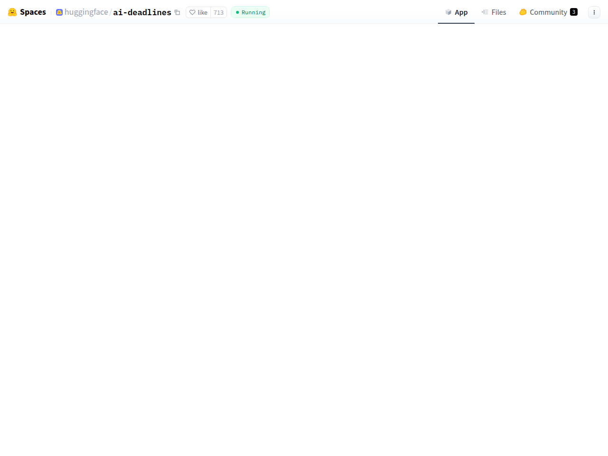

<h1 align="center"> :tada: Big News </h1>

<h4 align="center"> :smile: Hi！Here is a knowledge repository shared by our group, encompassing meaningful papers, practical technical tools, intriguing topics, and more！ </h4>

<div style="text-align: center;"> DDL是第一生产力:rocket:  </div>

<br>


[](https://aideadlin.es/?sub=CV,ML)   

***
&nbsp;
&nbsp;

> 💡Tips：为了更好的维护这个仓库，在这里设置一些简单的规则，大家有建议可以及时提
> 
> > 1. 这个仓库中仅仅放置一些每周组会讨论的内容并及时更新，因此大家需要及时更新[REPORT.md](REPORT.md)
> > 2. 对于一些学术分享，大家可以放到这个[share repo](https://github.com/ReadingPapers/Share)中
> > 3. 为了能够“所见即所得”，一些ppt，pdf文件大家先放到这个[谷歌drive共享文件夹](https://drive.google.com/drive/folders/1n6cK69oLMHE6Dw4b-_EWb6DZGJZK02GY?usp=sharing)(<10G)中，然后在github中链接一下这些文件即可
> > 

&nbsp;
&nbsp;

```
ReadingPapers
├──  Report # 仅仅分享一些临时的，常用的，及时的内容
│    ├── readme.md # 对repo进行说明
│    ├── report.md # 对每周汇报的论文进行简单的分类介绍
|    └── 
├──  Share # 一些成熟的学术资源分享 (可以先建立自己的branch)
│    ├── readme.md # 
│    ├── 入门篇
│    │    ├── 学习资源
│    │    ├── 如何找论文，看论文
│    │    ├── 科研工具
│    │    └── 
│    ├── 进阶篇
│    │    ├── 学术分享 # 不同研究方向
│    │    │    ├── 小组的研究方向
│    │    │    │    ├── 人脸情绪识别
│    │    │    │    ├── 微表情识别
│    │    │    │    ├── 脑电信号情绪识别
│    │    │    │    ├── 视觉语言导航
│    │    │    │    └──
│    │    │    ├── 其他相关的研究方向
│    │    │    │    ├── 大模型
│    │    │    │    ├── 对比学习
│    │    │    │    ├── 对比学习
│    │    │    └── 
│    │    ├── 如何想ideas 
│    │    ├── 论文实验&代码 
│    │    ├── 写作 
│    │    ├── 审稿
│    │    └── 
│    ├── 成神篇
│    │    ├── 如何申请项目 
│    │    └── 

```

&nbsp;
&nbsp;
