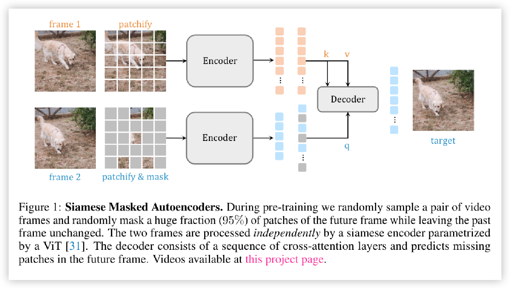
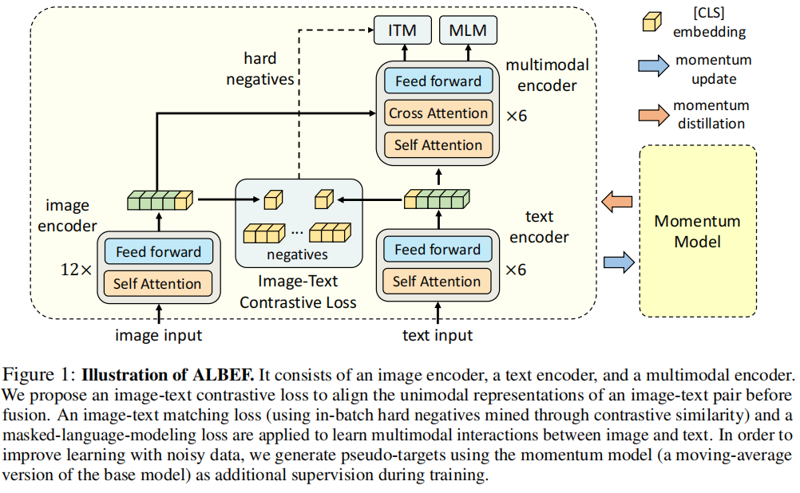

> 按照一下格式介绍分享的paper，定期归类整理！  
内容包含：标题, 相关连接(pdf,code，silde), 一段话介绍，主要模型框架图

**---------------------------------目录-----------------------------**

<!-- TOC -->
  * [Deep Learning](#deep-learning)
    * [PETL: parameters effective transfer learning](#petl-parameters-effective-transfer-learning)
  * [NLP](#nlp)
  * [CV](#cv)
    * [ Facial expression recognition](#font-colorgreen-facial-expression-recognitionfont)
  * [Multimodality](#multimodality)
  * [Embodied AI](#embodied-ai)
    * [ Navigation ](#font-colorgreen-navigation-font-)
      * [Visual language navigation](#visual-language-navigation)
    * [ Manipulate ](#font-colorgreen-manipulate-font-)
    * [ Robotic ](#font-colorgreen-robotic-font-)
<!-- TOC -->

**---------------------------------目录-----------------------------**

## Deep Learning

### PETL: parameters effective transfer learning

> 相关链接：
> - NLP领域的Prompt Tuning综述：[链接](https://mp.weixin.qq.com/s/dz6Ad_pVveXwe6O0RvF7iw) 
> - [MAM adapter](https://mp.weixin.qq.com/s/dz6Ad_pVveXwe6O0RvF7iw): 对adapter等petl的相关变体进行了分析总结(推荐)
> - 常见的petl变体：[AIM](https://github.com/taoyang1122/adapt-image-models)(代码友好) ，[lora](https://arxiv.org/pdf/2106.09685.pdf)，[Adapter](http://proceedings.mlr.press/v97/houlsby19a/houlsby19a.pdf) ，[LST](https://github.com/ylsung/Ladder-Side-Tuning)
> - [知乎](https://zhuanlan.zhihu.com/p/635686756)上对的petl总结（强推）
> - 我自己的一些简单理解[petl简述](https://docs.google.com/presentation/d/14NLwCCgrwxSN30pNhAH5jUxKyRWuKS2r/edit?usp=drive_link)
>> , , 

## NLP

## CV

###  Facial expression recognition
&nbsp;
> Siamese Masked Autoencoders (NeurIPS 2023 Oral)  
> [Paper](https://siam-mae-video.github.io/resources/paper.pdf), 
> [Code](https://siam-mae-video.github.io/),
> [Slide](Slide/2023.10.20-SiamMAE-陈银.pptx)
> 
>> 描述

&nbsp;

## Multimodality
&nbsp;

> Align before Fuse: Vision and Language
Representation Learning with Momentum Distillation (NeurIPS 2021)  
> [Paper](https://arxiv.org/abs/2107.07651), 
> [Code](https://github.com/salesforce/ALBEF),
> [Blog](https://blog.salesforceairesearch.com/align-before-fuse/),
> [Slide](Slide/2023.10.20-SiamMAE-陈银.pptx)
> 
>> 描述

&nbsp;

## Embodied AI
&nbsp;
###  Navigation  
&nbsp;
#### Visual language navigation

&nbsp;
###  Manipulate  
&nbsp;

###  Robotic  
&nbsp;
