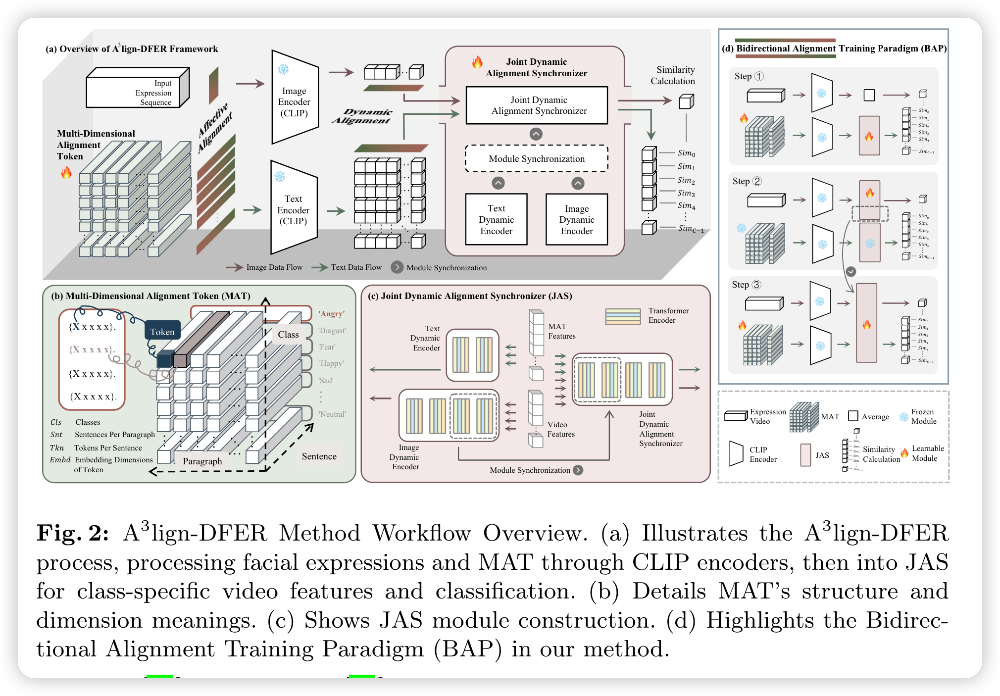

######### 模版 #############

> [日期]-[总结人]-[论文标题]-[来源]（附带链接，链接可选）
>  
> > 论文框架图（有助于一眼就能想起论文内容）
> 
> > 论文简述 （一两句话总结精华，切勿过长）

######### 模版 #############

> [2023-3-13]-[陈银]-[A $^3$ lign-DFER: Pioneering Comprehensive Dynamic Affective Alignment for Dynamic Facial Expression Recognition with CLIP]-[Arxiv](https://arxiv.org/abs/2403.04294)
>  
> > 论文框架图（有助于一眼就能想起论文内容）
> 
> > 论文简述
在CLIP的基础上，提出多个模块，从affective, dynamic和bidirectional三个角度实现了动态情感对齐，达到了较高的performance。在vision-language模型里达到了SOTA。
