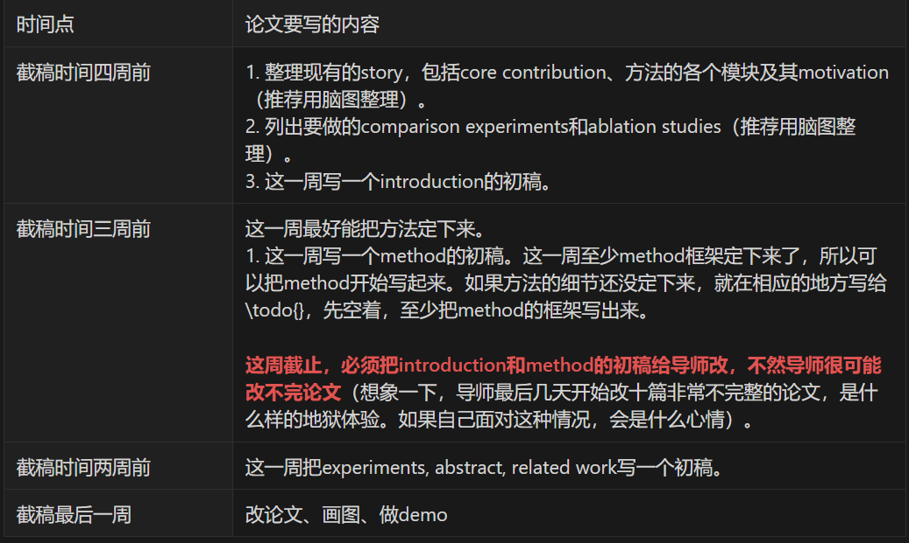

# 研究经验分享

<!-- TOC -->
* [研究经验分享](#研究经验分享)
  * [一，学习习惯](#一学习习惯)
    * [1. #工具#​-工欲善其事必先利其器](#1-工具-工欲善其事必先利其器)
    * [2. #经验#​-他山之石可以攻玉](#2-经验-他山之石可以攻玉)
    * [3. #Fellow的人#​-站在巨人的肩膀上](#3-fellow的人-站在巨人的肩膀上)
    * [4. #教程#​-学而时习之](#4-教程-学而时习之)
  * [二，想Ideas](#二想ideas)
  * [三，实验，代码](#三实验代码)
  * [四，写作](#四写作)
  * [五，做ppt](#五做ppt)
<!-- TOC -->

### 一，学习习惯

‍

##### 1. #工具#​-工欲善其事必先利其器

1. 笔记软件：思源

    ‍
2. 论文工具

    * 找论文：

      * 论文短语库 [Academic Phrasebank | The University of Manchester](https://www.phrasebank.manchester.ac.uk/)
      * 顶会论文列表 [amusi/daily-paper-computer-vision: 记录每天整理的计算机视觉/深度学习/机器学习相关方向的论文 (github.com)](https://github.com/amusi/daily-paper-computer-vision)
    * 看论文：Ivysci

      [The latest in Machine Learning | Papers With Code](https://paperswithcode.com/)

      [Connected Papers | Find and explore academic papers](https://www.connectedpapers.com/)，破解方法（无痕浏览）
    * 写论文

      * 写作#经验#​​：

        [顶会论文写作建议（上）：宏观布局，避免“hard to follow” - 知乎 (zhihu.com)](https://zhuanlan.zhihu.com/p/593195527)

        [顶会论文写作建议（下）：精耕细作，提高“readability” - 知乎 (zhihu.com)](https://zhuanlan.zhihu.com/p/639732057)

        写作技巧：[https://github.com/MLNLP-World/Paper-Writing-Tips](https://github.com/MLNLP-World/Paper-Writing-Tips)

        ‍
      * latex#教程 #​​：[Learn LaTeX in 30 minutes - Overleaf, Online LaTeX Editor](https://www.overleaf.com/learn/latex/Learn_LaTeX_in_30_minutes)

        math-latex：[short-math-guide.pdf](assets/short-math-guide-20230807005434-ycwr5tp.pdf)

        在线math转latex：[Mathcha - Online Math Editor](https://www.mathcha.io/) #待学习#​​

        表格转latex工具：[Create LaTeX tables online – TablesGenerator.com](https://www.tablesgenerator.com/)

        ‍
    * 投论文

      [中国计算机学会推荐国际学术会议和期刊目录-2022 1.pdf](assets/中国计算机学会推荐国际学术会议和期刊目录-2022 1-20230807004328-o328s10.pdf)

      [tsinghua_list.pdf](assets/tsinghua_list-20230807004344-vleoc3r.pdf)

      [计算领域高质量科技期刊分级目录.pdf](assets/计算领域高质量科技期刊分级目录-20230807004559-0cgblp7.pdf)

##### 2. #经验#​-他山之石可以攻玉

* 如何做研究

  一个系统的学习研究经验：[MarSaKi/learning_research: 本人博士期间的科研经验 (github.com)](https://github.com/MarSaKi/learning_research)

  [John_Schulman的科研经验.pdf](assets/John_Schulman的科研经验-20230801201924-y4w3w5j.pdf)

  一个MIT教授的意见：[doresearch.pdf](assets/doresearch-20230802161537-fwo38yz.pdf)

  [Michael_Nielsen的科研经验.pdf](assets/Michael_Nielsen的科研经验-20230801203229-uvzhkec.pdf)

  管理你的phd：[masteringyourphd.pdf](assets/masteringyourphd-20230807011247-s83gkt1.pdf)

  [龚浩棠 |博士建议 (harvard.edu)](https://www.eecs.harvard.edu/htk/phdadvice/)
* 翁莉莲的博客（干货）：[利尔日志 (lilianweng.github.io)](https://lilianweng.github.io/)

##### 3. #Fellow的人#​-站在巨人的肩膀上

‍

##### 4. #教程#​-学而时习之

* PPT作图参考-[ML Visuhttps://docs.google.com/presentation/u/0/?authuser=0&amp;usp=slides_webals - Google 幻灯片](https://docs.google.com/presentation/d/11mR1nkIR9fbHegFkcFq8z9oDQ5sjv8E3JJp1LfLGKuk/edit#slide=id.p)

* 深度学习代码调优-[google-research/tuning_playbook: A playbook for systematically maximizing the performance of deep learning models. (github.com)](https://github.com/google-research/tuning_playbook)

‍

### 二，想Ideas

<iframe>
 height=1000
 width=100%
 src="https://pengsida.notion.site/idea-da6ce171c13846b7a7ffaa7473ffa6ea"  
 frameborder=0  
 allowfullscreen>
 </iframe>

### 三，实验，代码

‍

> 实验过程不要想到哪是哪，不妨认真完成一个实验报告，这一部分其实相当于论文中的实验部分
>
> 代码实现用chatgpt工具

**实验记录：**

1. 实验的目的：描述为什么做这个实验，想通过实验获得什么。
2. 实验的setting：什么样的数据上做的实验，算法上有什么改动。
3. 记录实验结果：记录效果好和效果不好的实验结果，包括可视化结果和量化结果。
4. 分析实验结果：观察实验结果是否符合预期。如果不符合预期，需要分析工作不work的原因。
5. Next step：你是project的leader，不断地思考如何进行下一步，列出接下来要做的实验，而不是等待instructions。

> 💡   Once you’ve ruled out the impossible, whatever remains, however improbable, must be true。
>
> 排除所有不可能的因素之后，无论剩下的多么难以置信，那就是真相。

### 四，写作

> 写作重要性依次是是内容（看实验报告），论文逻辑（参考论文写作模板），语言表达（chatgpt就可）

‍

1. 写作#经验#​​教程

    ‍
2. 论文写作

    论文写作流程

    * 论文写作流程

      * 💡 什么时候要开始写论文：一般情况下，至少要在**截稿时间一个月前**就开始写论文。
      * 论文写作节奏

        > 1. **列出方法的每一个模块。对于每一个module，回答两个问题**：为什么要用这个module、这个module为什么work。（**把回答整理成脑图或表格的形式**）
        >
        > 2. 将上面的回答组织成一个story：倒推，然后正推。详细做法见Introduction部分。
        >
        > 3. 写完论文后，仔细检查每一个statement说法上有没有问题，有没有实验进行支撑。  
        >
        > 英语写作的节奏：先列写作思路，然后细化每一部分的思路，再写具体的英语句子。注意段落、句子之间的flow。（flow的概念具体看这个[文档](/74aef88b9187439fa4e301704f6eb49a)。）
        >

        论文
      * 时间流​​
    * 论文写作模板
    *
        <iframe>

 height=850
 width=90%
 src="https://pengsida.notion.site/idea-da6ce171c13846b7a7ffaa7473ffa6ea"  
 frameborder=0  
 allowfullscreen>
 </iframe>
      * 论文语料库

      论文语料库

3. 怎么练习写作

    1. 每天读一篇论文，然后用自己的话写出总结：

        1. 一句话描述这篇论文的Novelty。
        2. 几句话描述这篇论文的Pipeline：第一步做了什么，第二步做了什么，第三步做了什么。
    2. 平时能清楚地给别人描述自己的想法/贡献/进展/疑问。
    3. 做展示的ppt，保证ppt有清楚的逻辑思路。
4. 怎么回复review审稿意见

    怎么回复审稿意见，进行rebuttal
5. 怎么审稿​

‍

‍

### 五，做ppt

> 💡Tips：
>
>  1. 根据听众对象调整汇报内容的level
>
>  2. 尽量简洁清晰
>
>  3. 先抛出问题，带着问题去看细节
>
>  4. 列出研究计划

* PPT模板：

  * 组会汇报模板

    * [组会汇报模板.pptx](assets/组会汇报模板-20230802212147-4boezxc.pptx)
  * 单独meet汇报模板

    * [单独meeting模板.pptx](assets/单独meeting模板-20230802212207-n10e6ok.pptx)
    * [小组会report模板.pptx](assets/小组会report模板-20231025143945-utjz5q8.pptx)
  * 综述模板（开题报告，毕业论文等）

    * [综述型模板.pptx](assets/综述型模板-20230802212157-uklrbe8.pptx)
  * 好看的PPT
  * PPT网站
    [首页 - Canva可画](https://www.canva.cn/)
  * 值得借鉴的ppt

    * [0522-cv-talk-v3-谢凌曦.pptx](assets/0522-cv-talk-v3-谢凌曦-20230803160348-4sv5m1m.pptx)

‍
